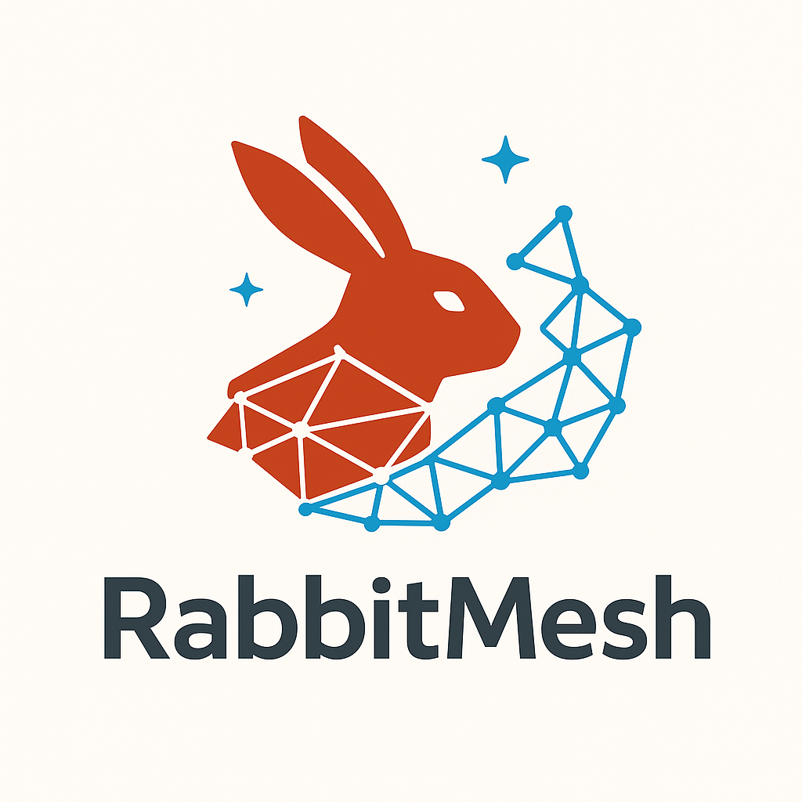

<div align="center">



# RabbitMesh
**Zero-Port Microservices Framework**

*Write business logic, get REST + GraphQL APIs automatically*

[](https://crates.io/crates/rabbitmesh)
[](https://docs.rs/rabbitmesh)
[](https://github.com/hangsiahong/rabbitmesh-rs)
[](https://github.com/hangsiahong/rabbitmesh-rs#license)

</div>

---

RabbitMesh eliminates traditional microservice complexity by using RabbitMQ for all inter-service communication. Write business logic, get REST + GraphQL APIs automatically.

## ✨ Key Features

- **🔥 Zero Port Management** - Services only connect to RabbitMQ
- **⚡ Never Blocks** - Every request spawns async task  
- **🎯 Auto-Generated APIs** - Write service methods, get REST + GraphQL
- **🎭 Universal Macros** - 50+ macros for auth, caching, validation, metrics
- **🛡️ Production Ready** - Built-in retries, timeouts, load balancing
- **🌍 Deploy Anywhere** - Docker, Kubernetes, bare metal

## 📚 Documentation

- **🚀 [Quick Start Guide](QUICK_START.md)** - Get started in 5 minutes
- **📖 [Complete Developer Guide](docs/DEVELOPER_GUIDE.md)** - Comprehensive guide with real-world examples
- **🏗️ [API Documentation](https://docs.rs/rabbitmesh)** - Full API reference
- **📋 [Publishing Guide](PUBLISH_GUIDE.md)** - How to publish to crates.io

## 🚀 Quick Start

### 1. Define Your Service

```rust
use rabbitmesh_macros::{service_definition, service_method};

#[service_definition]
pub struct UserService;

impl UserService {
    #[service_method("GET /users/:id")]
    pub async fn get_user(user_id: u32) -> Result<User, String> {
        // Your business logic only
        Ok(User { id: user_id, name: "John".to_string() })
    }
    
    #[service_method("POST /users")]  
    pub async fn create_user(data: CreateUserRequest) -> Result<User, String> {
        // Handle user creation
        Ok(User { id: 1, name: data.name })
    }
}
```

### 2. Start Your Service

```rust
use rabbitmesh::MicroService;

#[tokio::main]
async fn main() -> Result<(), Box<dyn std::error::Error>> {
    let service = MicroService::new("amqp://localhost:5672").await?;
    service.start().await?;  // Never blocks, handles requests concurrently
    Ok(())
}
```

### 3. Auto-Generated API Gateway

```rust
use rabbitmesh_gateway::create_auto_router;

#[tokio::main] 
async fn main() {
    let app = create_auto_router().await;
    
    // Automatically provides:
    // GET  /api/v1/user-service/users/123
    // POST /api/v1/user-service/users
    // GraphQL endpoint at /graphql
    
    axum::Server::bind(&"0.0.0.0:3000".parse().unwrap())
        .serve(app.into_make_service())
        .await
        .unwrap();
}
```

## 🏗️ Architecture

```
┌─────────────┐    ┌─────────────┐    ┌─────────────────────────────────┐
│   Frontend  │────│ API Gateway │────│        Service Mesh             │
│  (NextJS)   │HTTP│ (Auto-Gen)  │AMQP│  ┌─────┐ ┌─────┐ ┌─────┐      │
│             │    │             │    │  │User │ │Auth │ │Order│ ...  │
└─────────────┘    └─────────────┘    │  └─────┘ └─────┘ └─────┘      │
                                      │           │                    │
                                      │     ┌─────────────┐            │
                                      │     │  RabbitMQ   │            │
                                      │     │   Broker    │            │
                                      └─────┴─────────────┴────────────┘
```

## 📦 Crates

- **`rabbitmesh`** - Core microservice framework  
- **`rabbitmesh-macros`** - Code generation macros
- **`rabbitmesh-gateway`** - Auto-generating API gateway
- **`examples/ecommerce`** - Complete demo application

## 🎯 Why RabbitMesh?

| Traditional HTTP | RabbitMesh |
|------------------|------------|
| ❌ Port management hell | ✅ Zero ports to manage |
| ❌ Manual load balancing | ✅ Automatic via RabbitMQ |
| ❌ Service discovery complexity | ✅ Auto-discovery via queues |
| ❌ Blocking request handlers | ✅ Every request is async |
| ❌ Manual API development | ✅ Auto-generated REST + GraphQL |

## 🚀 Performance

- **Latency**: 3-10ms (vs 1-5ms HTTP direct)
- **Throughput**: Higher than HTTP (persistent connections)
- **Concurrency**: Unlimited (every request = async task)
- **Scalability**: Linear (add instances = proportional capacity)

## 📋 Getting Started

See the [examples/simple-todo](examples/simple-todo) directory for a complete working example, or use our AI agent to create new projects:

```bash
# Install the AI agent and create a new project
python3 rabbitmesh_agent.py create my-awesome-service
```

## 🤝 Contributing

We welcome contributions! Please see our [Contributing Guide](https://github.com/hangsiahong/rabbitmesh-rs/blob/main/CONTRIBUTING.md) for details.

- 🐛 [Report Bugs](https://github.com/hangsiahong/rabbitmesh-rs/issues)
- 💡 [Request Features](https://github.com/hangsiahong/rabbitmesh-rs/issues)
- 🔀 [Submit Pull Requests](https://github.com/hangsiahong/rabbitmesh-rs/pulls)

## 📄 License

MIT license. See [LICENSE](LICENSE) for details.

---

<div align="center">


**Built with ❤️ by the RabbitMesh Team**

[🦀 Crates.io](https://crates.io/crates/rabbitmesh) • [📚 Docs](https://docs.rs/rabbitmesh) • [🐙 GitHub](https://github.com/hangsiahong/rabbitmesh-rs) • [💬 Discussions](https://github.com/hangsiahong/rabbitmesh-rs/discussions)

*The future of microservices is here - zero ports, maximum power, pure elegance* ✨

</div>