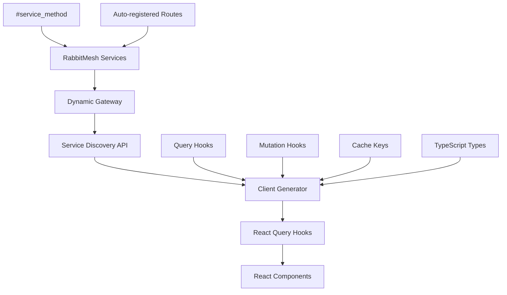

# RabbitMesh React Query Client Generator

Automatically generate **React Query hooks** for your RabbitMesh microservices with full type safety, caching, and modern React patterns.

## What This Solves

When you have 100+ microservices with hundreds of endpoints, manually writing API integration code for React applications becomes:
- **Time-consuming** - Writing HTTP requests and React Query hooks manually
- **Error-prone** - Typos in URLs, request/response types, cache keys
- **Unmaintainable** - Hard to keep frontend in sync with backend changes
- **No IntelliSense** - Missing autocomplete and type checking
- **Poor caching** - Inconsistent cache key patterns across teams

## What You Get

✨ **Auto-generated React Query hooks** from your live microservices  
✨ **Dynamic service discovery** - No hardcoded service definitions  
✨ **Full autocomplete support** in VS Code and other editors  
✨ **Type safety** - Compile-time errors for API misuse  
✨ **Optimistic caching** - Built-in cache keys for React Query  
✨ **Zero configuration** - Just import and use  
✨ **Scales automatically** - Works with 1 service or 100+ services  

## Quick Example

**Instead of this:**
```typescript
// Manual React Query setup - error-prone, inconsistent caching
const { data } = useQuery(['users', userId], async () => {
  const response = await fetch(`/api/users/${userId}`);
  return response.json(); // any type
});

const mutation = useMutation(async (userData: any) => {
  const response = await fetch('/api/users', {
    method: 'POST',
    headers: { 'Content-Type': 'application/json' },
    body: JSON.stringify(userData)
  });
  return response.json();
});
```

**You get this:**
```typescript
// Generated hooks - full autocomplete, proper caching, and type safety! ✨
import { configureRabbitMeshClient, useGetUser, useCreateUser } from '@your-org/rabbitmesh-client';

// Configure once in your app
configureRabbitMeshClient('http://localhost:3333');

// Use in your components
const { data: user, isLoading } = useGetUser(userId); // ✅ Fully typed
const createUserMutation = useCreateUser({
  onSuccess: () => {
    // ✅ Built-in cache invalidation patterns
    queryClient.invalidateQueries({ queryKey: userKeys.listUsers() });
  }
});

await createUserMutation.mutateAsync({ data: { name: "John", email: "john@example.com" } });
```

## Installation

```bash
cd client-generator
npm install
```

## Usage

### Generate React Query Client from Running Gateway

The generator **dynamically discovers** your services from your running RabbitMesh gateway:

```bash
npm run generate -- --gateway-url http://localhost:3333 --output ./my-client --package-name "@myorg/react-query-api"
```

### CLI Options

```bash
npx rabbitmesh-client-generator --help

Options:
  -u, --gateway-url <url>      Gateway URL (default: "http://localhost:8081")
  -o, --output <dir>           Output directory (default: "./generated-client")
  -p, --package-name <name>    Package name (default: "@your-org/rabbitmesh-client")
  --include-services <services> Comma-separated list of services to include
  --exclude-services <services> Comma-separated list of services to exclude
  -h, --help                   Display help for command
```

## Generated Structure

```
generated-client/
├── package.json          # NPM package with React Query dependencies
├── tsconfig.json         # TypeScript configuration
├── index.ts              # Main exports (all hooks and utilities)
├── types.ts              # All TypeScript type definitions
├── client.ts             # Configuration utilities
├── authClient.ts         # Auth service React Query hooks
├── userClient.ts         # User service React Query hooks
├── orderClient.ts        # Order service React Query hooks
└── ...                   # One file per discovered service
```

## Integration Workflow

### 1. Development Workflow

```bash
# 1. Update your Rust services with new endpoints
# 2. Ensure your RabbitMesh gateway is running
docker-compose up -d

# 3. Regenerate the React Query client
npm run generate -- --gateway-url http://localhost:3333 --output ./frontend-client

# 4. Build and publish (optional)
cd frontend-client
npm run build
npm publish
```

### 2. Frontend Integration

```bash
# In your React/Next.js project
npm install @tanstack/react-query @your-org/rabbitmesh-client
```

```typescript
// Configure in your App.tsx or main.tsx
import { QueryClient, QueryClientProvider } from '@tanstack/react-query';
import { configureRabbitMeshClient } from '@your-org/rabbitmesh-client';

const queryClient = new QueryClient();

// Configure the generated client
configureRabbitMeshClient({
  baseURL: process.env.REACT_APP_API_URL,
  headers: {
    'Authorization': `Bearer ${getAuthToken()}`
  }
});

function App() {
  return (
    <QueryClientProvider client={queryClient}>
      <YourApp />
    </QueryClientProvider>
  );
}
```

```typescript
// Use in your React components
import { useGetUser, useCreateUser, useListUsers, userKeys } from '@your-org/rabbitmesh-client';

function UserProfile({ userId }: { userId: string }) {
  // ✅ GET requests become useQuery hooks
  const { data: user, isLoading, error } = useGetUser(userId);
  
  // ✅ POST/PUT/DELETE requests become useMutation hooks
  const createUserMutation = useCreateUser({
    onSuccess: () => {
      // ✅ Cache keys are auto-generated for proper invalidation
      queryClient.invalidateQueries({ queryKey: userKeys.listUsers() });
    }
  });

  if (isLoading) return <div>Loading...</div>;
  if (error) return <div>Error: {error.message}</div>;

  return (
    <div>
      <h1>{user?.data?.name}</h1>
      <button onClick={() => createUserMutation.mutate({ 
        data: { name: "New User", email: "user@example.com" } 
      })}>
        Create User
      </button>
    </div>
  );
}
```

### 3. CI/CD Integration

Add to your CI pipeline to auto-generate and publish clients when services change:

```yaml
# .github/workflows/generate-client.yml
name: Generate React Query Client
on:
  push:
    branches: [main]
    paths: ['**/service.rs', '**/handler.rs']

jobs:
  generate:
    runs-on: ubuntu-latest
    steps:
      - uses: actions/checkout@v3
      
      - name: Start services
        run: docker-compose up -d
        
      - name: Wait for gateway
        run: |
          timeout 60 bash -c 'until curl -f http://localhost:3333/health; do sleep 2; done'
      
      - name: Generate React Query client
        run: |
          cd client-generator
          npm install
          npm run generate -- --gateway-url http://localhost:3333 --output ./generated-client
          
      - name: Publish client
        run: |
          cd client-generator/generated-client
          npm publish --access public
        env:
          NPM_TOKEN: ${{ secrets.NPM_TOKEN }}
```

## Generated React Query Features

### Query Hooks (GET requests)

```typescript
// Generated from GET endpoints
export function useGetUser(
  id: string,
  options?: Omit<UseQueryOptions<GetUserResponse>, 'queryKey' | 'queryFn'>
) {
  return useQuery({
    queryKey: userKeys.getUser(id),
    queryFn: async () => {
      const response = await axios.get(`/api/v1/user-service/users/${id}`);
      return response.data;
    },
    ...options,
  });
}
```

### Mutation Hooks (POST/PUT/DELETE requests)

```typescript
// Generated from POST/PUT/DELETE endpoints
export function useCreateUser(
  options?: UseMutationOptions<CreateUserResponse, Error, { data: any }>
) {
  return useMutation({
    mutationFn: async (variables: { data: any }) => {
      const response = await axios.post(`/api/v1/user-service/users`, variables.data);
      return response.data;
    },
    ...options,
  });
}
```

### Cache Keys for Optimal Caching

```typescript
// Auto-generated cache key factories
export const userKeys = {
  getUser: (id: string) => ['user', 'getUser', id] as const,
  listUsers: () => ['user', 'listUsers'] as const,
  getUserByEmail: (email: string) => ['user', 'getUserByEmail', email] as const,
} as const;
```

## Dynamic Service Discovery

The generator **automatically discovers** all your services and endpoints from your running RabbitMesh gateway - no manual configuration required!

1. **Fetches live service registry** from `/api/services` endpoint
2. **Extracts all endpoints** with HTTP methods and paths
3. **Infers path parameters** from URL patterns like `/users/{id}`
4. **Generates appropriate hooks** - queries for GET, mutations for POST/PUT/DELETE
5. **Creates optimized cache keys** for React Query

## Architecture



## Benefits

🚀 **Modern React Patterns**
- React Query hooks out of the box
- Optimistic caching and background refetching
- Built-in loading/error states

🔒 **Type Safety**
- Full TypeScript support
- Auto-generated types from live services
- Compile-time error checking

📈 **Scalability**
- Completely dynamic - no hardcoded services
- Auto-discovers new endpoints
- Works with any number of services

⚡ **Developer Experience**
- Zero configuration required
- Full IDE autocomplete
- Consistent patterns across all services

🔄 **Always Up-to-Date**
- Generates from live running services
- No stale API documentation
- Single source of truth

## Example Generated Usage

```typescript
import { 
  useGetUser, useCreateUser, useUpdateUser, useDeleteUser,
  useGetOrder, useCreateOrder, useConfirmOrder,
  useLogin, useValidateToken,
  userKeys, orderKeys, authKeys 
} from '@myorg/rabbitmesh-client';

function MyComponent() {
  // ✅ Queries with automatic caching
  const { data: user } = useGetUser("123");
  const { data: orders } = useGetUserOrders("123");
  
  // ✅ Mutations with proper typing
  const loginMutation = useLogin();
  const createOrderMutation = useCreateOrder({
    onSuccess: () => {
      // ✅ Invalidate related queries
      queryClient.invalidateQueries({ queryKey: orderKeys.getUserOrders() });
    }
  });
  
  return (
    <div>
      <h1>{user?.data?.name}</h1>
      <button onClick={() => createOrderMutation.mutate({ 
        data: { items: [{ id: 1, quantity: 2 }] }
      })}>
        Create Order
      </button>
    </div>
  );
}
```

## Next Steps

1. **Try it out**: Generate a React Query client for your current services
2. **Integrate**: Use it in a React/Next.js project with `@tanstack/react-query`
3. **Automate**: Add to your CI/CD pipeline
4. **Scale**: As you add more services, they automatically appear as hooks!

## Contributing

The generator can be extended to support:
- WebSocket subscriptions
- Server-sent events
- Custom authentication patterns
- Optimistic update patterns
- Advanced cache invalidation strategies