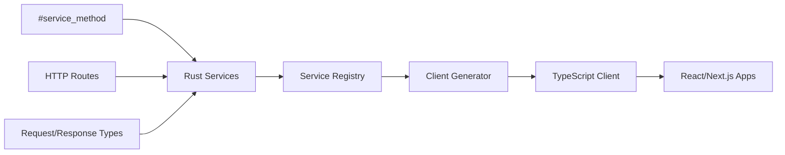

# RabbitMesh TypeScript Client Generator

Automatically generate TypeScript clients for your RabbitMesh microservices with full type safety and autocomplete support.

## What This Solves

When you have 100+ microservices with hundreds of endpoints, manually writing API integration code for frontend applications becomes:
- **Time-consuming** - Writing HTTP requests manually
- **Error-prone** - Typos in URLs, request/response types
- **Unmaintainable** - Hard to keep frontend in sync with backend changes
- **No IntelliSense** - Missing autocomplete and type checking

## What You Get

✨ **Auto-generated TypeScript client** from your Rust service definitions
✨ **Full autocomplete support** in VS Code and other editors
✨ **Type safety** - Compile-time errors for API misuse
✨ **Zero configuration** - Just import and use
✨ **Scales automatically** - Works with 1 service or 100+ services

## Quick Example

**Instead of this:**
```typescript
// Manual HTTP requests - error-prone, no autocomplete
const response = await fetch('/api/todos', {
  method: 'POST',
  headers: { 'Content-Type': 'application/json' },
  body: JSON.stringify({ title: 'Learn TS', description: 'Master it' })
});
const todo = await response.json(); // any type
```

**You get this:**
```typescript
// Generated client - full autocomplete and type safety! ✨
import { RabbitMeshClient } from '@your-org/rabbitmesh-client'

const client = new RabbitMeshClient('http://localhost:3000')
const todo = await client.todo.createTodo({
  title: "Learn TypeScript", 
  description: "Master the language"
}) // todo is fully typed as TodoResponse
```

## Installation

```bash
cd client-generator
npm install
```

## Usage

### Generate Client from Running Gateway

```bash
npm run generate -- --gateway-url http://localhost:3000 --output ./my-client --package-name "@myorg/api-client"
```

### Generate Client Manually (Recommended for Development)

```bash
npm run generate -- --manual --output ./my-client --package-name "@myorg/api-client"
```

### CLI Options

```bash
npx rabbitmesh-client-generator --help

Options:
  -u, --gateway-url <url>      Gateway URL (default: "http://localhost:3000")
  -o, --output <dir>           Output directory (default: "./generated-client")
  -p, --package-name <name>    Package name (default: "@your-org/rabbitmesh-client")
  --include-services <services> Comma-separated list of services to include
  --exclude-services <services> Comma-separated list of services to exclude
  --manual                     Use manual service definitions instead of fetching from gateway
  -h, --help                   Display help for command
```

## Generated Structure

```
generated-client/
├── package.json          # NPM package configuration
├── tsconfig.json         # TypeScript configuration
├── index.ts              # Main exports
├── types.ts              # All type definitions
├── client.ts             # Main RabbitMeshClient class
├── todoClient.ts         # Individual service client
├── userClient.ts         # Another service client
├── orderClient.ts        # Yet another service client
├── example.ts            # Usage examples
└── README.md             # Usage documentation
```

## Integration Workflow

### 1. Development Workflow

```bash
# 1. Update your Rust services with new endpoints
# 2. Regenerate the client
npm run generate -- --manual --output ./frontend-client

# 3. Build and publish (optional)
cd frontend-client
npm run build
npm publish
```

### 2. Frontend Integration

```bash
# In your React/Next.js/Vue project
npm install @your-org/rabbitmesh-client
```

```typescript
// Use in your frontend code
import { RabbitMeshClient } from '@your-org/rabbitmesh-client'

const client = new RabbitMeshClient(process.env.REACT_APP_API_URL)

// Full autocomplete for all your services!
await client.todo.createTodo({ title: "New todo" })
await client.user.getProfile(userId)
await client.order.createOrder({ items: [...] })
```

### 3. CI/CD Integration

Add to your CI pipeline to auto-generate and publish clients:

```yaml
# .github/workflows/generate-client.yml
name: Generate TS Client
on:
  push:
    branches: [main]
    paths: ['**/service.rs', '**/models.rs']

jobs:
  generate:
    runs-on: ubuntu-latest
    steps:
      - uses: actions/checkout@v3
      
      - name: Generate TypeScript client
        run: |
          cd client-generator
          npm install
          npm run generate -- --manual --output ./generated-client
          
      - name: Publish client
        run: |
          cd client-generator/generated-client
          npm publish --access public
        env:
          NPM_TOKEN: ${{ secrets.NPM_TOKEN }}
```

## Adding New Services

When you add a new service with `#[service_definition]`:

```rust
#[service_definition]
pub struct UserService;

#[service_impl]
impl UserService {
    #[service_method("GET /users/:id")]
    pub async fn get_user(user_id: String) -> Result<UserResponse, String> {
        // implementation
    }
    
    #[service_method("POST /users")]
    pub async fn create_user(request: CreateUserRequest) -> Result<UserResponse, String> {
        // implementation
    }
}
```

Regenerate the client and you automatically get:

```typescript
// Automatically available!
await client.user.getUser(userId)
await client.user.createUser({ name: "John", email: "john@example.com" })
```

## Architecture



## Benefits

🚀 **Developer Productivity**
- No manual API client code
- Full IDE support with autocomplete
- Immediate feedback on API changes

🔒 **Type Safety**
- Compile-time error checking
- Prevents runtime API errors
- Self-documenting code

📈 **Scalability**
- Works with 1 or 100+ services
- Auto-discovery of new endpoints
- Consistent patterns across all services

🔄 **Maintainability**
- Single source of truth (Rust service definitions)
- Automatic synchronization
- Version tracking

## Next Steps

1. **Try it out**: Generate a client for your current services
2. **Integrate**: Use it in a React/Next.js project
3. **Automate**: Add to your CI/CD pipeline
4. **Scale**: As you add more services, they automatically appear in the client!

## Contributing

This generator can be extended to support:
- GraphQL endpoints
- WebSocket connections
- Different authentication methods
- Custom serializers
- OpenAPI/Swagger generation